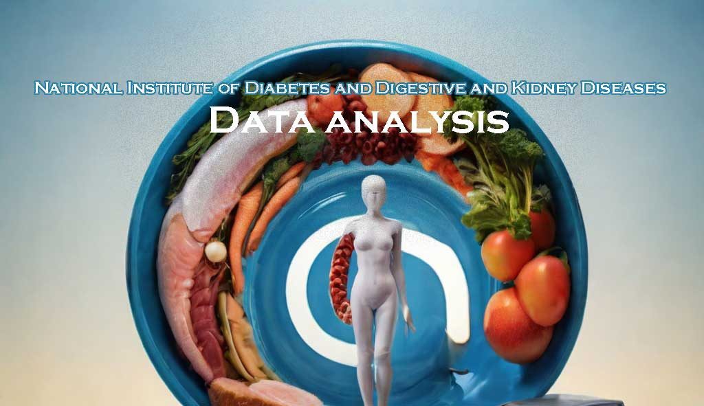
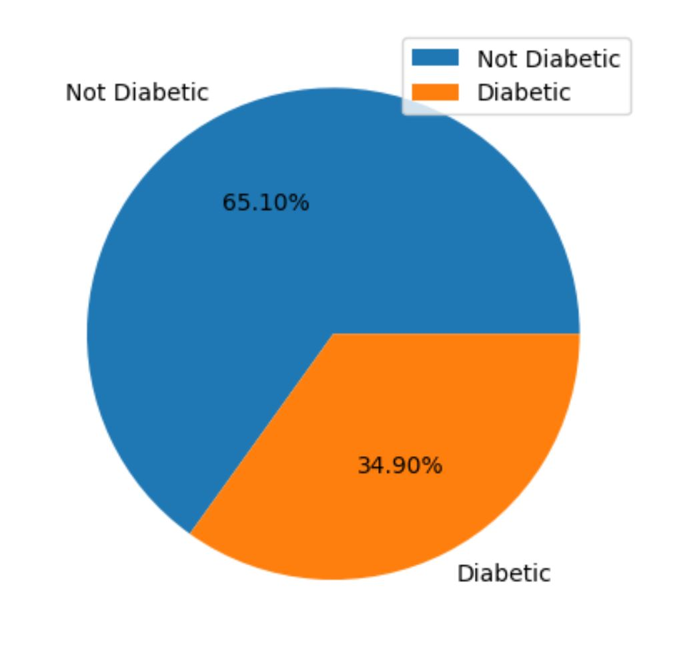
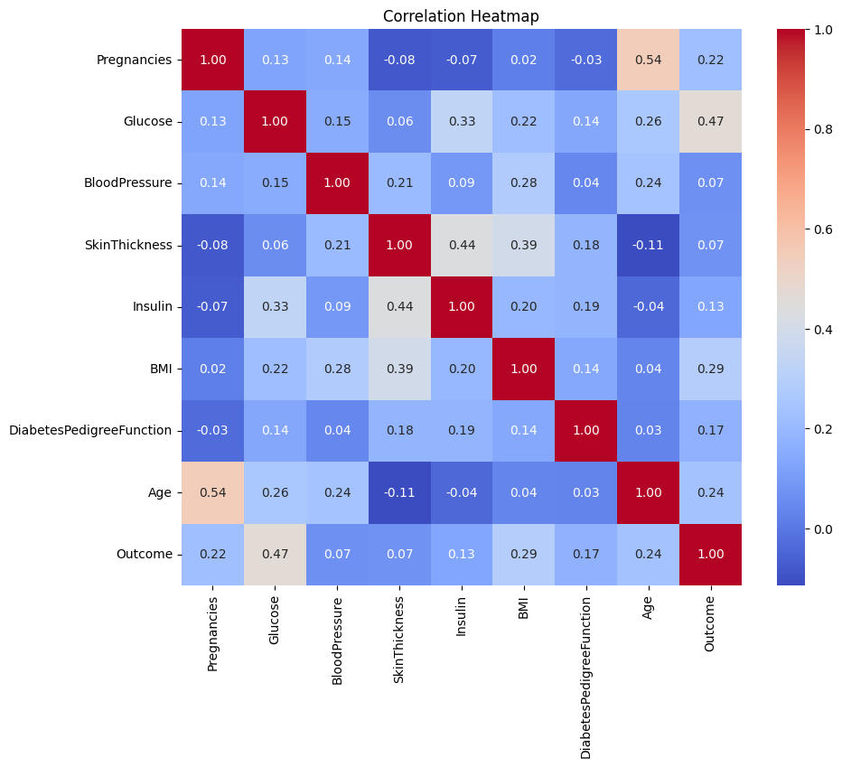
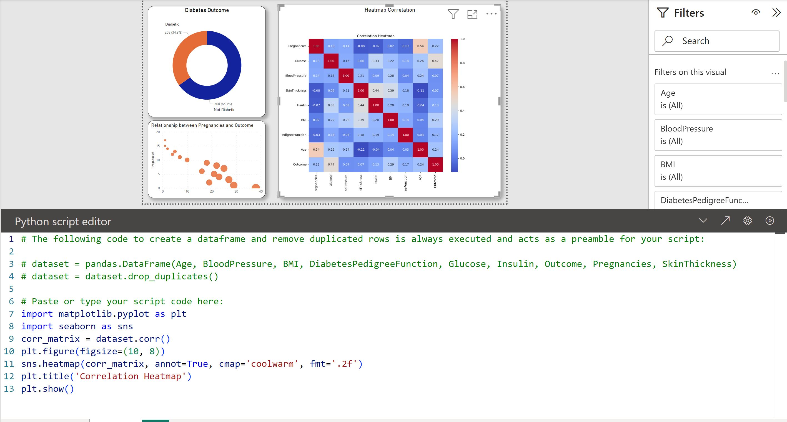
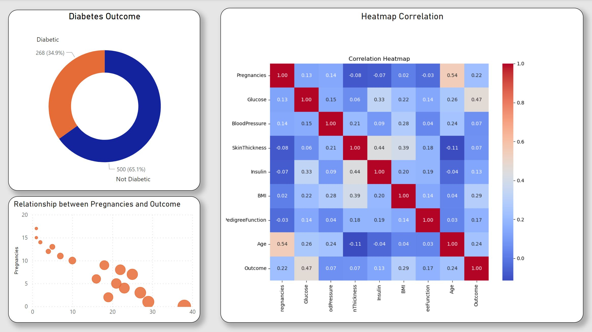

# National-Institute-of-Diabetes-and-Digestive-and-Kidney-Diseases

### Overview

This dataset originates from the National Institute of Diabetes and Digestive and Kidney Diseases. Its primary objective is to predict, diagnostically, the presence or absence of diabetes in patients based on specific diagnostic measurements included in the dataset.

The dataset's creation involved several constraints imposed on the selection of instances from a more extensive database. Notably, all patients included in this dataset are females, aged at least 21 years, and belong to the Pima Indian heritage.

### Dataset Details

**Source**: National Institute of Diabetes and Digestive and Kidney Diseases
**Objective**: Predicting the presence or absence of diabetes in patients based on diagnostic measurements.
**Constraints**: Patients are exclusively females aged 21 years or older, and of Pima Indian heritage.

## Contents

The dataset encompasses various diagnostic measurements, possibly including factors such as glucose levels, blood pressure, body mass index (BMI), insulin levels, and other relevant medical indicators

### Tools Used
1. Python
2. Microsoft Power BI

### Analysis

The dataset underwent preparation, processing, and transformation utilizing Python. During this phase, no duplicates or missing values were detected. Initial visualization was performed in Python to extract preliminary insights from the data before exporting it to Microsoft Power BI for comprehensive data profiling and visualization.

Python-based visuals:

| Python Pie chart visual |   Python heatmap visual     |
|-------------------------|-----------------------------|
|  |  | 

Subsequently, in-depth data profiling and analysis were carried out using Microsoft Power BI to uncover further insights from the dataset. Custom visualization was employed within Power BI, utilizing Python scripting to effectively communicate correlations through heatmap visuals.

Microsoft Power BI custom visuals:

### Insights

1. 65.10% of the females are not diabetic while the rest are.
2. **Pregnancies**: This variable has a strong positive correlation with 'Age' (0.544341), indicating that older women in the dataset tend to have more pregnancies. It has a weak positive correlation with 'Glucose' (0.129459) and 'BloodPressure' (0.141282), and a weak negative correlation with 'SkinThickness' (-0.081672) and 'Insulin' (-0.073535).

3. **Glucose**: This variable has a moderate positive correlation with 'Insulin' (0.331357), indicating that higher glucose levels are associated with higher insulin levels. It also has a weak positive correlation with 'BloodPressure' (0.152590), 'BMI' (0.221071), and 'Age' (0.263514).

4. **BloodPressure**: This variable has a weak positive correlation with 'SkinThickness' (0.207371), 'BMI' (0.281805), and 'Age' (0.239528).

5. **SkinThickness**: This variable has a moderate positive correlation with 'Insulin' (0.436783) and 'BMI' (0.392573), indicating that higher skin thickness is associated with higher insulin levels and higher BMI.

6. **Insulin**: This variable has a moderate positive correlation with 'Glucose' (0.331357) and 'SkinThickness' (0.436783).

7. **BMI**: This variable has a moderate positive correlation with 'SkinThickness' (0.392573) and a weak positive correlation with 'Glucose' (0.221071) and 'BloodPressure' (0.281805).

8. **DiabetesPedigreeFunction**: This variable has a weak positive correlation with 'Glucose' (0.137337), 'SkinThickness' (0.183928), and 'Insulin' (0.185071).

9. **Age**: This variable has a strong positive correlation with 'Pregnancies' (0.544341) and a weak positive correlation with 'Glucose' (0.263514) and 'BloodPressure' (0.239528).

### Usage

This dataset serves as a valuable resource for predictive modeling and machine learning applications, particularly in healthcare analytics. Researchers, data scientists, and practitioners interested in diabetes prediction models can leverage this dataset for analysis, model building, and evaluating predictive algorithms.

### Acknowledgement

I acknowledge the National Institute of Diabetes and Digestive and Kidney Diseases for providing this dataset, which contributes significantly to research and advancements in diabetes diagnostics and predictive modeling.

